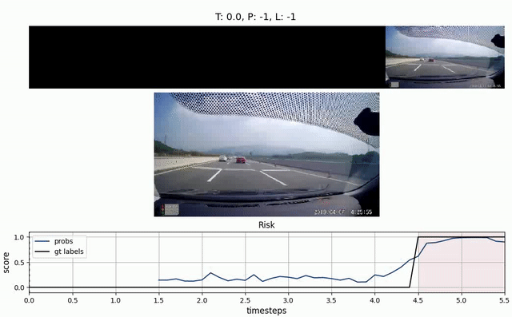
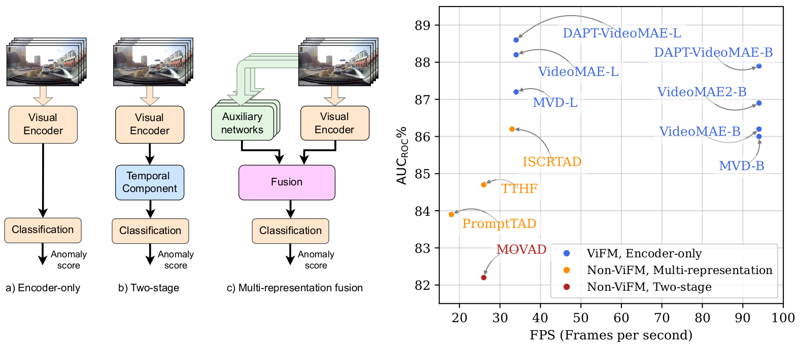
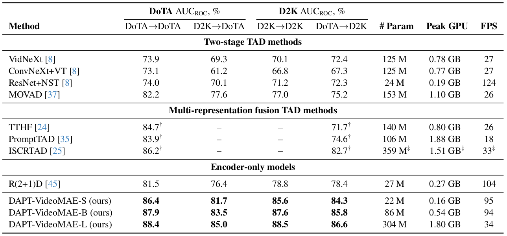
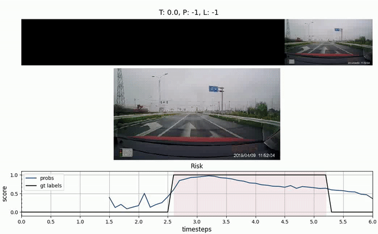

# Simplifying Traffic Anomaly Detection with Video Foundation Models

Svetlana Orlova, Tommie Kerssies, Brunó B. Englert, Gijs Dubbelman \
Eindhoven University of Technology

[](https://arxiv.org/abs/2507.09338)
[](https://huggingface.co/tue-mps/simple-tad) 

<p align="center">
  <a href="https://youtu.be/hY2hUlTNhCU" target="_blank">
    
  </a>
  <a href="https://youtu.be/tKe2nTIHf9k" target="_blank">
    
  </a>
</p>

Recent methods for ego-centric Traffic Anomaly Detection (TAD) often rely on complex multi-stage or multi-representation fusion architectures, yet it remains unclear whether such complexity is necessary. Recent findings in visual perception suggest that foundation models, enabled by advanced pre-training, allow simple yet flexible architectures to outperform specialized designs. Therefore, in this work, we investigate an architecturally simple encoder-only approach using plain Video Vision Transformers (Video ViTs) and study how pre-training enables strong TAD performance. We find that: (i) advanced pre-training enables simple encoder-only models to match or even surpass the performance of specialized state-of-the-art TAD methods, while also being significantly more efficient; (ii) although weakly- and fully-supervised pre-training are advantageous on standard benchmarks, we find them less effective for TAD. Instead, self-supervised Masked Video Modeling (MVM) provides the strongest signal; and (iii) Domain-Adaptive Pre-Training (DAPT) on unlabeled driving videos further improves downstream performance, without requiring anomalous examples. Our findings highlight the importance of pre-training and show that effective, efficient, and scalable TAD models can be built with minimal architectural complexity.



### ✨ DoTA and DADA-2000 results



Video ViT-based encoder-only models set a new state of the art
on both datasets, while being significantly more efficient than top-performing specialized methods. FPS measured using NVIDIA A100
MIG, 2 1 GPU. † From prior work. ‡ Optimistic estimates using publicly available components of the model. “A→B”: trained on A, tested
on B; D2K: DADA-2000.

## 📍Model Zoo

We provide pre-trained and fine-tuned models in [MODEL_ZOO.md](MODEL_ZOO.md).

## 🔨 Installation

Please follow the instructions in [INSTALL.md](INSTALL.md).

## 🗄️ Data Preparation

Please follow the instructions in [DATASET.md](DATASET.md) for data preparation.

## 🔄 Domain-Adaptive Pre-training (DAPT) and Fine-tuning

Please follow the instructions in [TRAIN.md](TRAIN.md).

## 🚀 Evaluation and Inference

Instructions are in [RUN.md](RUN.md).

## ☎️ Contact 

Svetlana Orlova: s.orlova@tue.nl, orsveri@gmail.com

## 👍 Acknowledgements

Our code is mainly based on the [VideoMAE](https://github.com/MCG-NJU/VideoMAE) codebase. 
With Video ViTs that have identical architecture, we only used their weights: 
[ViViT](https://github.com/google-research/scenic/blob/main/scenic/projects/vivit/README.md),
[VideoMAE2](https://github.com/OpenGVLab/VideoMAEv2), 
[SMILE](https://github.com/fmthoker/SMILE), 
[SIGMA](https://github.com/QUVA-Lab/SIGMA/), 
[MME](https://github.com/XinyuSun/MME), 
[MGMAE](https://github.com/MCG-NJU/MGMAE). \
We used fragments of original implementations of 
[MVD](https://github.com/ruiwang2021/mvd), 
[InternVideo2](https://github.com/OpenGVLab/InternVideo/tree/main/InternVideo2/single_modality), 
and [UMT](https://github.com/OpenGVLab/unmasked_teacher/tree/main/single_modality) to integrate these models with our codebase.

## 🔒 License

The majority of this project is released under the CC-BY-NC 4.0 license as found in the [LICENSE](https://github.com/MCG-NJU/VideoMAE/blob/main/LICENSE) file. 
Portions of the project are available under separate license terms: 
[ViViT](https://github.com/google-research/scenic/blob/main/scenic/projects/vivit/README.md), [InternVideo2](https://github.com/OpenGVLab/InternVideo/tree/main/InternVideo2/single_modality), [SlowFast](https://github.com/facebookresearch/SlowFast) and [pytorch-image-models](https://github.com/rwightman/pytorch-image-models) are licensed under the Apache 2.0 license. 
[VideoMAE2](https://github.com/OpenGVLab/VideoMAEv2), [SMILE](https://github.com/fmthoker/SMILE), [MGMAE](https://github.com/MCG-NJU/MGMAE), [UMT](https://github.com/OpenGVLab/unmasked_teacher/tree/main/single_modality), and [BEiT](https://github.com/microsoft/unilm/tree/master/beit) are licensed under the MIT license.
[SIGMA](https://github.com/QUVA-Lab/SIGMA/) is licensed under the BSD 3-Clause Clear license

## ✏️ Citation

If you think this project is helpful, please feel free to leave a star⭐️ and cite our paper:

```
@inproceedings{orlova2025simplifying,
  title={Simplifying Traffic Anomaly Detection with Video Foundation Models},
  author={Orlova, Svetlana and Kerssies, Tommie and Englert, Brun{\'o} B and Dubbelman, Gijs},
  booktitle={Proceedings of the IEEE/CVF International Conference on Computer Vision},
  pages={852--862},
  year={2025}
}
```

##

<p align="center">
  <a href="https://youtu.be/vPBKj9SF9yg" target="_blank">
    
  </a>
  <a href="https://youtu.be/vGaYPZEuv5k" target="_blank">
    
  </a>
</p>

<p align="center">
  <a href="https://youtu.be/7rH0QP18zsk" target="_blank">
    
  </a>
  <a href="https://youtu.be/5ZNYwDGmOZI" target="_blank">
    
  </a>
</p>

<p align="center">
  <a href="https://youtu.be/X7Ij1sc4yCE" target="_blank">
    
  </a>
  <a href="https://youtu.be/S5m2ooY6CGc" target="_blank">
    
  </a>
</p>

